# Knowledge graph of the Statki codebase

This document models the Battleship ("Statki") codebase as a knowledge graph: 82 nodes (constants, helpers, classes, methods, UI functions and resources) connected by 217 typed edges. Every node and edge is taken from `game.js`, `index.html`, `style.css` and `logic-test.js`; line numbers refer to the current `main`.

## How to read this graph

- **Nodes** are named code entities. The `kind` column in the node table classifies them:
  - `constant` – a top-level immutable value (`SIZE`, `FLEET`, `I18N`).
  - `helper` – a free function with no DOM access of its own (`inBoard`, `key`, `neighbours`, `t`, `tr`, `beep`, `boom`).
  - `class` / `method` – `Board` and `AI` and the methods defined on them.
  - `UI-function` – a function in the `game` section of `game.js` that reads or writes the DOM, including the anonymous event handlers at `game.js:820-842`.
  - `resource` – something a function reads or writes rather than calls: mutable state (`state`, `Board.shots`, `AI.tried`, …), cached DOM references (`els`, cell arrays), DOM event sources, browser storage, and the source files themselves.
- **Edges** read left to right as `source → relation → target`:
  - `calls` – source invokes the target function/method (including via `setTimeout`).
  - `uses` – source depends on the target without calling it as a function (reads a constant, instantiates a class, applies a helper under a specific option, relies on CSS rules).
  - `reads` / `writes` – source reads or mutates the target resource. Writes to `els` mean writing to the DOM elements it caches.
  - `listens-to` – source is registered as an event listener on the target DOM event source.
  - `persists` – source saves data to browser storage.
  - `tests` – `logic-test.js` asserts behaviour of the target.
- **Subgraphs** in the diagram group nodes by section of `game.js` (separated by the `// ---------------------------------------------------------------- sound` / `i18n` / `game` comment lines) or by file. Methods and fields of `Board` and `AI` are placed inside their class subgraph instead of being linked by membership edges.
- The outer subgraph "DOM-free logic" is exactly the code `logic-test.js` loads: everything above the `// ---------------------------------------------------------------- sound` line (`game.js:198`).
- The diagram and the two tables contain the same nodes and the same edges; the tables add file locations, descriptions and edge notes.

## Diagram

```mermaid
graph TD
  subgraph sg_logic["DOM-free logic: game.js lines 1-197, above the '// --- sound' separator"]
    subgraph sg_helpers["Helpers"]
      SIZE["SIZE"]
      FLEET["FLEET"]
      inBoard["inBoard(r, c)"]
      key["key(r, c)"]
      neighbours["neighbours(r, c, diagonal)"]
    end
    subgraph sg_board["class Board"]
      Board["Board"]
      cellShip["Board.cellShip"]
      shots["Board.shots"]
      ships["Board.ships"]
      shipAt["Board.shipAt"]
      cellsFor["Board.cellsFor"]
      canPlace["Board.canPlace"]
      place["Board.place"]
      clear["Board.clear"]
      fire["Board.fire"]
      allSunk["Board.allSunk"]
      randomize["Board.randomize"]
      placeRandomShip["Board.placeRandomShip"]
    end
    subgraph sg_ai["class AI"]
      AI["AI"]
      tried["AI.tried"]
      excluded["AI.excluded"]
      targetHits["AI.targetHits"]
      candidatesFromTarget["AI.candidatesFromTarget"]
      huntCandidates["AI.huntCandidates"]
      nextShot["AI.nextShot"]
      record["AI.record"]
    end
  end
  subgraph sg_audio["Audio (game.js 'sound' section)"]
    audioCtx["audioCtx"]
    beep["beep(freq, duration, type)"]
    boom["boom(big)"]
  end
  subgraph sg_i18n["i18n (game.js 'i18n' section)"]
    I18N["I18N"]
    lang["lang"]
    tr["tr(key)"]
    t["t(key, ...args)"]
    applyLanguage["applyLanguage(next)"]
    localStorage["localStorage 'statki-lang'"]
  end
  subgraph sg_ui["UI layer (game.js 'game' section)"]
    els["els"]
    state["state"]
    cells["playerCells / enemyCells"]
    buildBoards["buildBoards"]
    cellFrom["cellFrom(event)"]
    nextSpec["nextSpec"]
    coordName["coordName(r, c)"]
    setStatus["setStatus"]
    addLog["addLog"]
    renderLog["renderLog"]
    renderScore["renderScore"]
    renderFleetList["renderFleetList"]
    clearPreview["clearPreview"]
    onPlayerBoardHover["onPlayerBoardHover"]
    onPlayerBoardClick["onPlayerBoardClick"]
    updatePlacementInfo["updatePlacementInfo"]
    hullPart["hullPart"]
    drawHull["drawHull"]
    resetCell["resetCell"]
    renderPlayerBoard["renderPlayerBoard"]
    renderEnemyBoard["renderEnemyBoard"]
    explode["explode"]
    markLastShot["markLastShot"]
    startGame["startGame"]
    onEnemyBoardClick["onEnemyBoardClick"]
    aiTurn["aiTurn"]
    finish["finish(playerWon)"]
    resetGame["resetGame"]
    toggleRotation["toggleRotation"]
  end
  subgraph sg_wiring["Event wiring and bootstrap (game.js:815-850)"]
    randomHandler["#random-btn click handler (anonymous)"]
    resetPlacementHandler["#reset-placement-btn click handler (anonymous)"]
    difficultyHandler["#difficulty change handler (anonymous)"]
    bootstrap["bootstrap (top-level)"]
  end
  subgraph sg_dom["DOM event sources"]
    domPlayerBoard["#player-board"]
    domEnemyBoard["#enemy-board"]
    domRotate["#rotate-btn"]
    domKeydown["document keydown"]
    domRandom["#random-btn"]
    domResetPlacement["#reset-placement-btn"]
    domStart["#start-btn"]
    domPlayAgain["#play-again-btn"]
    domDifficulty["#difficulty"]
    domLangBtn[".lang-btn"]
  end
  subgraph sg_files["Files"]
    indexHtml["index.html"]
    cssFile["style.css"]
    gameJs["game.js"]
    logicTest["logic-test.js"]
  end
  inBoard -->|"uses"| SIZE
  key -->|"uses"| SIZE
  neighbours -->|"calls"| inBoard
  shipAt -->|"reads"| cellShip
  shipAt -->|"calls"| key
  canPlace -->|"calls"| inBoard
  canPlace -->|"reads"| cellShip
  canPlace -->|"uses"| neighbours
  place -->|"writes"| ships
  place -->|"writes"| cellShip
  clear -->|"writes"| ships
  clear -->|"writes"| cellShip
  clear -->|"writes"| shots
  fire -->|"reads"| shots
  fire -->|"reads"| cellShip
  fire -->|"writes"| shots
  fire -->|"writes"| ships
  allSunk -->|"reads"| ships
  randomize -->|"calls"| clear
  randomize -->|"uses"| FLEET
  randomize -->|"calls"| placeRandomShip
  placeRandomShip -->|"calls"| cellsFor
  placeRandomShip -->|"calls"| canPlace
  placeRandomShip -->|"calls"| place
  candidatesFromTarget -->|"reads"| targetHits
  candidatesFromTarget -->|"reads"| tried
  candidatesFromTarget -->|"uses"| neighbours
  candidatesFromTarget -->|"calls"| inBoard
  huntCandidates -->|"reads"| tried
  huntCandidates -->|"reads"| excluded
  huntCandidates -->|"reads"| ships
  nextShot -->|"calls"| candidatesFromTarget
  nextShot -->|"calls"| huntCandidates
  nextShot -->|"writes"| targetHits
  nextShot -->|"reads"| tried
  record -->|"writes"| tried
  record -->|"writes"| targetHits
  record -->|"uses"| neighbours
  record -->|"writes"| excluded
  beep -->|"uses"| audioCtx
  boom -->|"uses"| audioCtx
  t -->|"reads"| I18N
  t -->|"reads"| lang
  t -->|"uses"| tr
  applyLanguage -->|"writes"| lang
  applyLanguage -->|"persists"| localStorage
  applyLanguage -->|"calls"| t
  applyLanguage -->|"writes"| els
  applyLanguage -->|"writes"| indexHtml
  applyLanguage -->|"reads"| state
  applyLanguage -->|"calls"| setStatus
  applyLanguage -->|"calls"| renderLog
  applyLanguage -->|"calls"| renderFleetList
  applyLanguage -->|"calls"| renderScore
  applyLanguage -->|"calls"| updatePlacementInfo
  applyLanguage -->|"listens-to"| domLangBtn
  els -->|"reads"| indexHtml
  state -->|"uses"| Board
  state -->|"uses"| AI
  buildBoards -->|"writes"| cells
  buildBoards -->|"calls"| coordName
  buildBoards -->|"reads"| els
  cellFrom -->|"reads"| cells
  nextSpec -->|"uses"| FLEET
  nextSpec -->|"reads"| state
  setStatus -->|"writes"| state
  setStatus -->|"calls"| t
  setStatus -->|"writes"| els
  addLog -->|"writes"| state
  addLog -->|"calls"| t
  addLog -->|"writes"| els
  renderLog -->|"reads"| state
  renderLog -->|"calls"| t
  renderLog -->|"writes"| els
  renderScore -->|"reads"| shots
  renderScore -->|"reads"| ships
  renderScore -->|"uses"| FLEET
  renderScore -->|"writes"| els
  renderFleetList -->|"uses"| FLEET
  renderFleetList -->|"reads"| state
  renderFleetList -->|"calls"| t
  renderFleetList -->|"writes"| els
  clearPreview -->|"writes"| cells
  clearPreview -->|"listens-to"| domPlayerBoard
  onPlayerBoardHover -->|"listens-to"| domPlayerBoard
  onPlayerBoardHover -->|"calls"| cellFrom
  onPlayerBoardHover -->|"calls"| nextSpec
  onPlayerBoardHover -->|"calls"| clearPreview
  onPlayerBoardHover -->|"calls"| cellsFor
  onPlayerBoardHover -->|"calls"| canPlace
  onPlayerBoardHover -->|"writes"| cells
  onPlayerBoardClick -->|"listens-to"| domPlayerBoard
  onPlayerBoardClick -->|"calls"| cellFrom
  onPlayerBoardClick -->|"calls"| nextSpec
  onPlayerBoardClick -->|"calls"| cellsFor
  onPlayerBoardClick -->|"calls"| canPlace
  onPlayerBoardClick -->|"calls"| place
  onPlayerBoardClick -->|"calls"| setStatus
  onPlayerBoardClick -->|"writes"| state
  onPlayerBoardClick -->|"calls"| clearPreview
  onPlayerBoardClick -->|"calls"| renderPlayerBoard
  onPlayerBoardClick -->|"calls"| renderFleetList
  onPlayerBoardClick -->|"calls"| updatePlacementInfo
  updatePlacementInfo -->|"calls"| nextSpec
  updatePlacementInfo -->|"calls"| t
  updatePlacementInfo -->|"calls"| setStatus
  updatePlacementInfo -->|"writes"| els
  drawHull -->|"calls"| hullPart
  renderPlayerBoard -->|"calls"| resetCell
  renderPlayerBoard -->|"calls"| shipAt
  renderPlayerBoard -->|"reads"| shots
  renderPlayerBoard -->|"calls"| drawHull
  renderPlayerBoard -->|"writes"| cells
  renderPlayerBoard -->|"uses"| cssFile
  renderEnemyBoard -->|"calls"| resetCell
  renderEnemyBoard -->|"calls"| shipAt
  renderEnemyBoard -->|"reads"| shots
  renderEnemyBoard -->|"calls"| drawHull
  renderEnemyBoard -->|"writes"| cells
  renderEnemyBoard -->|"uses"| cssFile
  explode -->|"writes"| cells
  explode -->|"uses"| cssFile
  markLastShot -->|"writes"| cells
  startGame -->|"listens-to"| domStart
  startGame -->|"uses"| FLEET
  startGame -->|"uses"| AI
  startGame -->|"writes"| state
  startGame -->|"calls"| clear
  startGame -->|"calls"| randomize
  startGame -->|"calls"| renderEnemyBoard
  startGame -->|"calls"| renderScore
  startGame -->|"calls"| setStatus
  startGame -->|"calls"| addLog
  onEnemyBoardClick -->|"listens-to"| domEnemyBoard
  onEnemyBoardClick -->|"reads"| state
  onEnemyBoardClick -->|"calls"| cellFrom
  onEnemyBoardClick -->|"calls"| fire
  onEnemyBoardClick -->|"calls"| renderEnemyBoard
  onEnemyBoardClick -->|"calls"| renderScore
  onEnemyBoardClick -->|"calls"| markLastShot
  onEnemyBoardClick -->|"calls"| coordName
  onEnemyBoardClick -->|"calls"| boom
  onEnemyBoardClick -->|"calls"| explode
  onEnemyBoardClick -->|"calls"| beep
  onEnemyBoardClick -->|"calls"| tr
  onEnemyBoardClick -->|"calls"| setStatus
  onEnemyBoardClick -->|"calls"| addLog
  onEnemyBoardClick -->|"calls"| allSunk
  onEnemyBoardClick -->|"calls"| finish
  onEnemyBoardClick -->|"writes"| state
  onEnemyBoardClick -->|"calls"| aiTurn
  aiTurn -->|"calls"| nextShot
  aiTurn -->|"calls"| fire
  aiTurn -->|"calls"| record
  aiTurn -->|"calls"| renderPlayerBoard
  aiTurn -->|"calls"| renderScore
  aiTurn -->|"calls"| markLastShot
  aiTurn -->|"calls"| coordName
  aiTurn -->|"calls"| boom
  aiTurn -->|"calls"| explode
  aiTurn -->|"calls"| beep
  aiTurn -->|"calls"| tr
  aiTurn -->|"calls"| setStatus
  aiTurn -->|"calls"| addLog
  aiTurn -->|"calls"| allSunk
  aiTurn -->|"calls"| finish
  aiTurn -->|"calls"| aiTurn
  aiTurn -->|"writes"| state
  finish -->|"writes"| state
  finish -->|"calls"| renderPlayerBoard
  finish -->|"calls"| renderEnemyBoard
  finish -->|"calls"| t
  finish -->|"writes"| els
  finish -->|"calls"| setStatus
  finish -->|"calls"| addLog
  resetGame -->|"listens-to"| domPlayAgain
  resetGame -->|"writes"| state
  resetGame -->|"uses"| Board
  resetGame -->|"uses"| AI
  resetGame -->|"calls"| t
  resetGame -->|"writes"| els
  resetGame -->|"calls"| renderPlayerBoard
  resetGame -->|"calls"| renderEnemyBoard
  resetGame -->|"calls"| renderFleetList
  resetGame -->|"calls"| renderScore
  resetGame -->|"calls"| updatePlacementInfo
  toggleRotation -->|"listens-to"| domRotate
  toggleRotation -->|"listens-to"| domKeydown
  toggleRotation -->|"writes"| state
  toggleRotation -->|"calls"| t
  toggleRotation -->|"calls"| clearPreview
  toggleRotation -->|"writes"| els
  randomHandler -->|"listens-to"| domRandom
  randomHandler -->|"calls"| randomize
  randomHandler -->|"writes"| state
  randomHandler -->|"calls"| renderPlayerBoard
  randomHandler -->|"calls"| renderFleetList
  randomHandler -->|"calls"| updatePlacementInfo
  resetPlacementHandler -->|"listens-to"| domResetPlacement
  resetPlacementHandler -->|"calls"| clear
  resetPlacementHandler -->|"writes"| state
  resetPlacementHandler -->|"calls"| renderPlayerBoard
  resetPlacementHandler -->|"calls"| renderFleetList
  resetPlacementHandler -->|"calls"| updatePlacementInfo
  difficultyHandler -->|"listens-to"| domDifficulty
  difficultyHandler -->|"uses"| AI
  difficultyHandler -->|"writes"| state
  bootstrap -->|"calls"| buildBoards
  bootstrap -->|"reads"| localStorage
  bootstrap -->|"calls"| applyLanguage
  indexHtml -->|"uses"| cssFile
  indexHtml -->|"uses"| gameJs
  logicTest -->|"reads"| gameJs
  logicTest -->|"tests"| Board
  logicTest -->|"tests"| AI
  logicTest -->|"uses"| FLEET
  logicTest -->|"uses"| SIZE
```

## Node table

| Name | Kind | File | Description |
| --- | --- | --- | --- |
| `SIZE` | constant | game.js:3 | Board edge length (10). |
| `FLEET` | constant | game.js:5 | Polish fleet spec: 1x4, 2x3, 3x2, 4x1 (10 ships, 20 cells), in placement order. |
| `inBoard(r, c)` | helper | game.js:18 | True if (r, c) lies inside the SIZE x SIZE grid. |
| `key(r, c)` | helper | game.js:19 | Flattens a coordinate to the integer key r * SIZE + c used by every Map/Set. |
| `neighbours(r, c, diagonal)` | helper | game.js:21 | In-board neighbour cells: 8-connected when diagonal=true, 4-connected otherwise. |
| `Board` | class | game.js:33 | One player's 10x10 grid: ships, cell-to-ship index and shot record. |
| `Board.cellShip` | resource | game.js:36 | Map: cell key -> ship object. |
| `Board.shots` | resource | game.js:37 | Map: cell key -> 'hit' or 'miss'; the single source of truth for shots fired at this board. |
| `Board.ships` | resource | game.js:35 | Array of ship objects {nameKey, size, cells, hits, sunk}. |
| `Board.shipAt` | method | game.js:40 | Returns the ship occupying (r, c) or null. |
| `Board.cellsFor` | method | game.js:44 | Lists the cells a ship of given size/orientation would occupy from (r, c); no validation. |
| `Board.canPlace` | method | game.js:54 | Placement rule: every cell in board, unoccupied, and no occupied 8-neighbour (ships never touch). |
| `Board.place` | method | game.js:62 | Creates a ship object and indexes its cells in cellShip. |
| `Board.clear` | method | game.js:69 | Empties ships, cellShip and shots. |
| `Board.fire` | method | game.js:75 | Resolves a shot: {repeat} if already shot, else records hit/miss, counts hits, flags sunk. |
| `Board.allSunk` | method | game.js:89 | True when the board has ships and all are sunk (win condition). |
| `Board.randomize` | method | game.js:93 | Up to 200 attempts: clear, then placeRandomShip for each FLEET entry. |
| `Board.placeRandomShip` | method | game.js:105 | Enumerates all legal placements of one spec and places a uniformly random one. |
| `AI` | class | game.js:123 | Computer opponent; 'hard' = hunt/target with parity, 'easy' = uniform random over untried cells. |
| `AI.tried` | resource | game.js:126 | Set of cell keys the AI has already fired at. |
| `AI.excluded` | resource | game.js:127 | Set of cell keys that cannot hold a ship (8-neighbours of sunk ships). |
| `AI.targetHits` | resource | game.js:128 | Hits on the ship currently being hunted down (target mode). |
| `AI.candidatesFromTarget` | method | game.js:131 | Target mode: 4-neighbours of a single hit, or the two open ends of a line of hits. |
| `AI.huntCandidates` | method | game.js:148 | Hunt mode: untried, non-excluded cells; hard mode keeps only (r + c) % 2 == 0 when the smallest living ship >= 2. |
| `AI.nextShot` | method | game.js:166 | Picks a random cell from target candidates, else hunt candidates, else any untried cell. |
| `AI.record` | method | game.js:183 | Updates tried; in hard mode tracks targetHits and, on sink, excludes the ship's neighbours. |
| `audioCtx` | resource | game.js:200 | Lazily created Web Audio AudioContext shared by beep and boom. |
| `beep(freq, duration, type)` | helper | game.js:201 | Short oscillator tone; used for misses. |
| `boom(big)` | helper | game.js:223 | Low-pass filtered decaying noise burst; longer/louder when big (sunk). |
| `I18N` | constant | game.js:254 | Translation tables for 'pl' and 'en'; values are strings or functions of arguments. |
| `lang` | resource | game.js:377 | Current language code (default 'en'). |
| `tr(key)` | helper | game.js:381 | Returns a lazy {i18nKey} wrapper so stored message args are translated at render time. |
| `t(key, ...args)` | helper | game.js:383 | Looks up I18N[lang][key]; calls function entries with args, resolving tr() wrappers recursively. |
| `applyLanguage(next)` | UI-function | game.js:500 | Switches lang, persists it, re-translates static [data-i18n] text and re-renders stored messages. |
| `localStorage 'statki-lang'` | resource | game.js:507, 849 | Browser storage key holding the chosen language across reloads. |
| `els` | resource | game.js:391 | Cached DOM element references from index.html (boards, controls, status, log, score cells, overlay). |
| `state` | resource | game.js:423 | Mutable game state: phase, horizontal, placedCount, player/enemy Boards, ai, busy, statusMsg, overlayMsg, logEntries. |
| `playerCells / enemyCells` | resource | game.js:436-437 | Arrays of the 100 cell buttons per board, indexed by key(r, c). |
| `buildBoards` | UI-function | game.js:439 | Creates 2 x 100 cell buttons and attaches the board event listeners. |
| `cellFrom(event)` | UI-function | game.js:463 | Maps a DOM event to {r, c, el} of the clicked/hovered cell. |
| `nextSpec` | UI-function | game.js:469 | FLEET entry the player places next (FLEET[state.placedCount]) or null. |
| `coordName(r, c)` | UI-function | game.js:473 | Human coordinate such as 'A1' (column letter, row number). |
| `setStatus` | UI-function | game.js:477 | Stores [key, ...args] in state.statusMsg and renders it into the status line. |
| `addLog` | UI-function | game.js:482 | Appends [key, ...args] to state.logEntries and a translated <li> to the shot log. |
| `renderLog` | UI-function | game.js:490 | Rebuilds the shot log from state.logEntries in the current language. |
| `renderScore` | UI-function | game.js:526 | Scoreboard: hits/misses/accuracy from board.shots, sunk/left from board.ships, for each side. |
| `renderFleetList` | UI-function | game.js:548 | Lists FLEET with done/next markers during placement. |
| `clearPreview` | UI-function | game.js:559 | Removes preview-ok/preview-bad classes from player cells. |
| `onPlayerBoardHover` | UI-function | game.js:563 | Placement preview: colours the would-be cells green (legal) or red (illegal). |
| `onPlayerBoardClick` | UI-function | game.js:578 | Places the next ship if canPlace, otherwise shows the illegal-placement message. |
| `updatePlacementInfo` | UI-function | game.js:597 | Placement hint text and Start button enabled state. |
| `hullPart` | UI-function | game.js:611 | Which hull piece (bow/mid/stern/single) and direction a ship cell shows. |
| `drawHull` | UI-function | game.js:621 | Writes data-part / data-dir on a cell for the CSS hull silhouette. |
| `resetCell` | UI-function | game.js:627 | Resets a cell to class 'cell' and drops hull data attributes. |
| `renderPlayerBoard` | UI-function | game.js:633 | Draws own ships (hulls), hits, misses and sunk ships. |
| `renderEnemyBoard` | UI-function | game.js:650 | Draws shots on the enemy board; hulls revealed only for sunk ships. |
| `explode` | UI-function | game.js:668 | Appends a short-lived .blast element (flash, shockwave, 8 shards) on the struck cell. |
| `markLastShot` | UI-function | game.js:682 | Moves the .last-shot outline to the latest shot. |
| `startGame` | UI-function | game.js:687 | Requires a full fleet; creates the AI, randomizes the enemy fleet, enters 'playing'. |
| `onEnemyBoardClick` | UI-function | game.js:701 | Player shot: hit keeps the turn, miss schedules aiTurn after 700 ms. |
| `aiTurn` | UI-function | game.js:736 | AI shot: hit reschedules aiTurn after 700 ms, miss returns the turn to the player. |
| `finish(playerWon)` | UI-function | game.js:770 | Enters 'over', reveals boards, stores and shows the win/lose overlay. |
| `resetGame` | UI-function | game.js:786 | Fresh Boards and AI, back to 'placement', clears log and overlay. |
| `toggleRotation` | UI-function | game.js:808 | Flips state.horizontal during placement and updates the rotate button. |
| `#random-btn click handler (anonymous)` | UI-function | game.js:820 | Randomizes the player's fleet and marks all ships placed. |
| `#reset-placement-btn click handler (anonymous)` | UI-function | game.js:829 | Clears the player's board during placement. |
| `#difficulty change handler (anonymous)` | UI-function | game.js:840 | Replaces state.ai with a new AI of the selected difficulty during placement. |
| `bootstrap (top-level)` | UI-function | game.js:847-850 | buildBoards, read saved language, applyLanguage. |
| `#player-board` | resource | index.html:82 | Player grid container. |
| `#enemy-board` | resource | index.html:86 | Enemy grid container (starts .disabled). |
| `#rotate-btn` | resource | index.html:62 | Rotate button. |
| `document keydown` | resource | game.js:816 | Global keyboard events; R/r rotates. |
| `#random-btn` | resource | index.html:63 | Randomize-fleet button. |
| `#reset-placement-btn` | resource | index.html:64 | Clear-placement button. |
| `#start-btn` | resource | index.html:65 | Start-game button (disabled until fleet placed). |
| `#play-again-btn` | resource | index.html:140 | Overlay play-again button. |
| `#difficulty` | resource | index.html:68 | AI level select (hard/easy). |
| `.lang-btn` | resource | index.html:33, 47 | Flag buttons with data-lang='en' / 'pl'. |
| `index.html` | resource | index.html | Page skeleton: [data-i18n] placeholders, boards, controls, scoreboard, log, overlay. |
| `style.css` | resource | style.css | Grid layout, cell state classes, hull silhouettes, blast/shockwave keyframes. |
| `game.js` | resource | game.js | All game code; the '// --- sound' separator (line 198) splits DOM-free logic from browser code. |
| `logic-test.js` | resource | logic-test.js | Headless Node checks; evaluates only the part of game.js above '// --- sound'. |

## Edge table

| Source | Relation | Target | Note |
| --- | --- | --- | --- |
| `inBoard(r, c)` | uses | `SIZE` |  |
| `key(r, c)` | uses | `SIZE` |  |
| `neighbours(r, c, diagonal)` | calls | `inBoard(r, c)` |  |
| `Board.shipAt` | reads | `Board.cellShip` |  |
| `Board.shipAt` | calls | `key(r, c)` |  |
| `Board.canPlace` | calls | `inBoard(r, c)` | off-board cells are illegal |
| `Board.canPlace` | reads | `Board.cellShip` | overlap check |
| `Board.canPlace` | uses | `neighbours(r, c, diagonal)` | diagonal=true: no occupied 8-neighbour, i.e. ships never touch, not even at corners |
| `Board.place` | writes | `Board.ships` |  |
| `Board.place` | writes | `Board.cellShip` |  |
| `Board.clear` | writes | `Board.ships` |  |
| `Board.clear` | writes | `Board.cellShip` |  |
| `Board.clear` | writes | `Board.shots` |  |
| `Board.fire` | reads | `Board.shots` | already shot -> {repeat: true} |
| `Board.fire` | reads | `Board.cellShip` |  |
| `Board.fire` | writes | `Board.shots` | 'hit' or 'miss' |
| `Board.fire` | writes | `Board.ships` | ship.hits++, ship.sunk when hits === size |
| `Board.allSunk` | reads | `Board.ships` |  |
| `Board.randomize` | calls | `Board.clear` | once per attempt, up to 200 attempts |
| `Board.randomize` | uses | `FLEET` |  |
| `Board.randomize` | calls | `Board.placeRandomShip` |  |
| `Board.placeRandomShip` | calls | `Board.cellsFor` | every cell x orientation (1-cell ships: horizontal only) |
| `Board.placeRandomShip` | calls | `Board.canPlace` |  |
| `Board.placeRandomShip` | calls | `Board.place` |  |
| `AI.candidatesFromTarget` | reads | `AI.targetHits` |  |
| `AI.candidatesFromTarget` | reads | `AI.tried` |  |
| `AI.candidatesFromTarget` | uses | `neighbours(r, c, diagonal)` | diagonal=false, only for a single hit |
| `AI.candidatesFromTarget` | calls | `inBoard(r, c)` | line ends must be in board |
| `AI.huntCandidates` | reads | `AI.tried` |  |
| `AI.huntCandidates` | reads | `AI.excluded` |  |
| `AI.huntCandidates` | reads | `Board.ships` | smallest living ship size; >= 2 enables the (r + c) % 2 == 0 parity filter (hard only) |
| `AI.nextShot` | calls | `AI.candidatesFromTarget` | preferred; hard mode only |
| `AI.nextShot` | calls | `AI.huntCandidates` | fallback when no target candidates |
| `AI.nextShot` | writes | `AI.targetHits` | reset to [] when falling back to hunt |
| `AI.nextShot` | reads | `AI.tried` | last-resort pool of any untried cell |
| `AI.record` | writes | `AI.tried` | every shot, both difficulties |
| `AI.record` | writes | `AI.targetHits` | push on hit, reset on sink (hard only) |
| `AI.record` | uses | `neighbours(r, c, diagonal)` | diagonal=true around each cell of a sunk ship |
| `AI.record` | writes | `AI.excluded` | neighbours of sunk ships cannot hold another ship |
| `beep(freq, duration, type)` | uses | `audioCtx` | created lazily on first sound |
| `boom(big)` | uses | `audioCtx` | created lazily on first sound |
| `t(key, ...args)` | reads | `I18N` |  |
| `t(key, ...args)` | reads | `lang` |  |
| `t(key, ...args)` | uses | `tr(key)` | unwraps {i18nKey} args by translating them in the current language |
| `applyLanguage(next)` | writes | `lang` | falls back to 'en' for unknown codes |
| `applyLanguage(next)` | persists | `localStorage 'statki-lang'` | setItem('statki-lang', lang) |
| `applyLanguage(next)` | calls | `t(key, ...args)` |  |
| `applyLanguage(next)` | writes | `els` | board aria-labels, rotate button label |
| `applyLanguage(next)` | writes | `index.html` | [data-i18n] text, document.title, <html lang>, .lang-btn aria-pressed |
| `applyLanguage(next)` | reads | `state` | re-renders stored statusMsg / overlayMsg; logEntries via renderLog; their tr() args re-resolve in the new language |
| `applyLanguage(next)` | calls | `setStatus` | setStatus(...state.statusMsg) |
| `applyLanguage(next)` | calls | `renderLog` |  |
| `applyLanguage(next)` | calls | `renderFleetList` |  |
| `applyLanguage(next)` | calls | `renderScore` |  |
| `applyLanguage(next)` | calls | `updatePlacementInfo` | keepStatus=true |
| `applyLanguage(next)` | listens-to | `.lang-btn` | click -> applyLanguage(btn.dataset.lang), game.js:843-845 |
| `els` | reads | `index.html` | getElementById / querySelectorAll at load |
| `state` | uses | `Board` | player and enemy boards |
| `state` | uses | `AI` | initial new AI('hard') |
| `buildBoards` | writes | `playerCells / enemyCells` | 100 buttons per board |
| `buildBoards` | calls | `coordName(r, c)` | cell aria-label |
| `buildBoards` | reads | `els` |  |
| `cellFrom(event)` | reads | `playerCells / enemyCells` | via event.target.closest('.cell') data-r / data-c |
| `nextSpec` | uses | `FLEET` |  |
| `nextSpec` | reads | `state` | placedCount |
| `setStatus` | writes | `state` | statusMsg = [key, ...args] |
| `setStatus` | calls | `t(key, ...args)` |  |
| `setStatus` | writes | `els` | els.status |
| `addLog` | writes | `state` | logEntries.push([key, ...args]) |
| `addLog` | calls | `t(key, ...args)` |  |
| `addLog` | writes | `els` | els.log |
| `renderLog` | reads | `state` | logEntries |
| `renderLog` | calls | `t(key, ...args)` |  |
| `renderLog` | writes | `els` | els.log |
| `renderScore` | reads | `Board.shots` | player column from state.enemy.shots, computer column from state.player.shots |
| `renderScore` | reads | `Board.ships` | sunk count; fleet left = FLEET.length - sunk |
| `renderScore` | uses | `FLEET` |  |
| `renderScore` | writes | `els` | els.score.* |
| `renderFleetList` | uses | `FLEET` |  |
| `renderFleetList` | reads | `state` | placedCount, phase |
| `renderFleetList` | calls | `t(key, ...args)` |  |
| `renderFleetList` | writes | `els` | els.fleetList |
| `clearPreview` | writes | `playerCells / enemyCells` | removes preview-ok / preview-bad |
| `clearPreview` | listens-to | `#player-board` | mouseleave, wired in buildBoards |
| `onPlayerBoardHover` | listens-to | `#player-board` | mouseover, wired in buildBoards |
| `onPlayerBoardHover` | calls | `cellFrom(event)` |  |
| `onPlayerBoardHover` | calls | `nextSpec` |  |
| `onPlayerBoardHover` | calls | `clearPreview` |  |
| `onPlayerBoardHover` | calls | `Board.cellsFor` |  |
| `onPlayerBoardHover` | calls | `Board.canPlace` | same rule as the real placement |
| `onPlayerBoardHover` | writes | `playerCells / enemyCells` | preview-ok / preview-bad |
| `onPlayerBoardClick` | listens-to | `#player-board` | click, wired in buildBoards |
| `onPlayerBoardClick` | calls | `cellFrom(event)` |  |
| `onPlayerBoardClick` | calls | `nextSpec` |  |
| `onPlayerBoardClick` | calls | `Board.cellsFor` |  |
| `onPlayerBoardClick` | calls | `Board.canPlace` |  |
| `onPlayerBoardClick` | calls | `Board.place` |  |
| `onPlayerBoardClick` | calls | `setStatus` | statusIllegal on invalid placement |
| `onPlayerBoardClick` | writes | `state` | placedCount++ |
| `onPlayerBoardClick` | calls | `clearPreview` |  |
| `onPlayerBoardClick` | calls | `renderPlayerBoard` |  |
| `onPlayerBoardClick` | calls | `renderFleetList` |  |
| `onPlayerBoardClick` | calls | `updatePlacementInfo` |  |
| `updatePlacementInfo` | calls | `nextSpec` |  |
| `updatePlacementInfo` | calls | `t(key, ...args)` |  |
| `updatePlacementInfo` | calls | `setStatus` | unless keepStatus |
| `updatePlacementInfo` | writes | `els` | placementInfo text, start.disabled |
| `drawHull` | calls | `hullPart` |  |
| `renderPlayerBoard` | calls | `resetCell` |  |
| `renderPlayerBoard` | calls | `Board.shipAt` |  |
| `renderPlayerBoard` | reads | `Board.shots` |  |
| `renderPlayerBoard` | calls | `drawHull` | all own ships |
| `renderPlayerBoard` | writes | `playerCells / enemyCells` | ship / hit / miss / sunk classes |
| `renderPlayerBoard` | uses | `style.css` | cell state classes and [data-part] hull rules |
| `renderEnemyBoard` | calls | `resetCell` |  |
| `renderEnemyBoard` | calls | `Board.shipAt` |  |
| `renderEnemyBoard` | reads | `Board.shots` |  |
| `renderEnemyBoard` | calls | `drawHull` | sunk ships only |
| `renderEnemyBoard` | writes | `playerCells / enemyCells` | hit / miss / sunk classes |
| `renderEnemyBoard` | uses | `style.css` |  |
| `explode` | writes | `playerCells / enemyCells` | appends .blast span with 8 shards |
| `explode` | uses | `style.css` | removed on the 'blast-life' animationend, or after 1500 ms |
| `markLastShot` | writes | `playerCells / enemyCells` | .last-shot |
| `startGame` | listens-to | `#start-btn` | click, game.js:838 |
| `startGame` | uses | `FLEET` | requires placedCount === FLEET.length |
| `startGame` | uses | `AI` | new AI(els.difficulty.value) |
| `startGame` | writes | `state` | phase = 'playing', ai |
| `startGame` | calls | `Board.clear` | enemy board |
| `startGame` | calls | `Board.randomize` | enemy board |
| `startGame` | calls | `renderEnemyBoard` |  |
| `startGame` | calls | `renderScore` |  |
| `startGame` | calls | `setStatus` |  |
| `startGame` | calls | `addLog` |  |
| `onEnemyBoardClick` | listens-to | `#enemy-board` | click, wired in buildBoards |
| `onEnemyBoardClick` | reads | `state` | ignored unless phase === 'playing' and !busy |
| `onEnemyBoardClick` | calls | `cellFrom(event)` |  |
| `onEnemyBoardClick` | calls | `Board.fire` | state.enemy.fire |
| `onEnemyBoardClick` | calls | `renderEnemyBoard` |  |
| `onEnemyBoardClick` | calls | `renderScore` |  |
| `onEnemyBoardClick` | calls | `markLastShot` |  |
| `onEnemyBoardClick` | calls | `coordName(r, c)` |  |
| `onEnemyBoardClick` | calls | `boom(big)` | on hit |
| `onEnemyBoardClick` | calls | `explode` | on hit |
| `onEnemyBoardClick` | calls | `beep(freq, duration, type)` | on miss |
| `onEnemyBoardClick` | calls | `tr(key)` | ship name args |
| `onEnemyBoardClick` | calls | `setStatus` |  |
| `onEnemyBoardClick` | calls | `addLog` |  |
| `onEnemyBoardClick` | calls | `Board.allSunk` | state.enemy |
| `onEnemyBoardClick` | calls | `finish(playerWon)` | finish(true) |
| `onEnemyBoardClick` | writes | `state` | busy = true on miss |
| `onEnemyBoardClick` | calls | `aiTurn` | setTimeout 700 ms, on miss only (hit = extra shot) |
| `aiTurn` | calls | `AI.nextShot` |  |
| `aiTurn` | calls | `Board.fire` | state.player.fire |
| `aiTurn` | calls | `AI.record` |  |
| `aiTurn` | calls | `renderPlayerBoard` |  |
| `aiTurn` | calls | `renderScore` |  |
| `aiTurn` | calls | `markLastShot` |  |
| `aiTurn` | calls | `coordName(r, c)` |  |
| `aiTurn` | calls | `boom(big)` | on hit |
| `aiTurn` | calls | `explode` | on hit |
| `aiTurn` | calls | `beep(freq, duration, type)` | on miss |
| `aiTurn` | calls | `tr(key)` | ship name args |
| `aiTurn` | calls | `setStatus` |  |
| `aiTurn` | calls | `addLog` |  |
| `aiTurn` | calls | `Board.allSunk` | state.player |
| `aiTurn` | calls | `finish(playerWon)` | finish(false) |
| `aiTurn` | calls | `aiTurn` | setTimeout 700 ms, on hit (extra shot) |
| `aiTurn` | writes | `state` | busy = false on miss |
| `finish(playerWon)` | writes | `state` | phase = 'over', busy = false, overlayMsg = [titleKey, textKey] |
| `finish(playerWon)` | calls | `renderPlayerBoard` |  |
| `finish(playerWon)` | calls | `renderEnemyBoard` |  |
| `finish(playerWon)` | calls | `t(key, ...args)` |  |
| `finish(playerWon)` | writes | `els` | overlay title/text, shows #overlay |
| `finish(playerWon)` | calls | `setStatus` |  |
| `finish(playerWon)` | calls | `addLog` |  |
| `resetGame` | listens-to | `#play-again-btn` | click, game.js:839 |
| `resetGame` | writes | `state` | phase = 'placement', fresh Boards and AI, overlayMsg = null, logEntries = [] |
| `resetGame` | uses | `Board` |  |
| `resetGame` | uses | `AI` |  |
| `resetGame` | calls | `t(key, ...args)` |  |
| `resetGame` | writes | `els` |  |
| `resetGame` | calls | `renderPlayerBoard` |  |
| `resetGame` | calls | `renderEnemyBoard` |  |
| `resetGame` | calls | `renderFleetList` |  |
| `resetGame` | calls | `renderScore` |  |
| `resetGame` | calls | `updatePlacementInfo` |  |
| `toggleRotation` | listens-to | `#rotate-btn` | click, game.js:815 |
| `toggleRotation` | listens-to | `document keydown` | key 'r' / 'R', game.js:816-818 |
| `toggleRotation` | writes | `state` | horizontal = !horizontal |
| `toggleRotation` | calls | `t(key, ...args)` |  |
| `toggleRotation` | calls | `clearPreview` |  |
| `toggleRotation` | writes | `els` | rotate button label |
| `#random-btn click handler (anonymous)` | listens-to | `#random-btn` | click, game.js:820-827 |
| `#random-btn click handler (anonymous)` | calls | `Board.randomize` | state.player |
| `#random-btn click handler (anonymous)` | writes | `state` | placedCount = FLEET.length |
| `#random-btn click handler (anonymous)` | calls | `renderPlayerBoard` |  |
| `#random-btn click handler (anonymous)` | calls | `renderFleetList` |  |
| `#random-btn click handler (anonymous)` | calls | `updatePlacementInfo` |  |
| `#reset-placement-btn click handler (anonymous)` | listens-to | `#reset-placement-btn` | click, game.js:829-836 |
| `#reset-placement-btn click handler (anonymous)` | calls | `Board.clear` | state.player |
| `#reset-placement-btn click handler (anonymous)` | writes | `state` | placedCount = 0 |
| `#reset-placement-btn click handler (anonymous)` | calls | `renderPlayerBoard` |  |
| `#reset-placement-btn click handler (anonymous)` | calls | `renderFleetList` |  |
| `#reset-placement-btn click handler (anonymous)` | calls | `updatePlacementInfo` |  |
| `#difficulty change handler (anonymous)` | listens-to | `#difficulty` | change, game.js:840-842 |
| `#difficulty change handler (anonymous)` | uses | `AI` | new AI(els.difficulty.value) |
| `#difficulty change handler (anonymous)` | writes | `state` | ai, only during placement |
| `bootstrap (top-level)` | calls | `buildBoards` |  |
| `bootstrap (top-level)` | reads | `localStorage 'statki-lang'` | getItem('statki-lang') \|\| 'en' |
| `bootstrap (top-level)` | calls | `applyLanguage(next)` |  |
| `index.html` | uses | `style.css` | <link rel=stylesheet> |
| `index.html` | uses | `game.js` | <script src=game.js> |
| `logic-test.js` | reads | `game.js` | split at '// --- sound', evaluated with new Function; exports Board, AI, FLEET, SIZE |
| `logic-test.js` | tests | `Board` | 500 random fleets legal; hit/sink/repeat/miss bookkeeping; canPlace touching/off-board |
| `logic-test.js` | tests | `AI` | hard and easy never repeat, hard always finishes with avg < 70 shots, easy worse than hard |
| `logic-test.js` | uses | `FLEET` |  |
| `logic-test.js` | uses | `SIZE` |  |

## Invariants

These hold in the current code and are what the edges above encode.

1. **Ships never touch, not even diagonally.** `Board.canPlace` rejects a cell if any of its `neighbours(r, c, true)` is occupied. Manual placement (`onPlayerBoardClick`), the hover preview (`onPlayerBoardHover`) and random placement (`Board.placeRandomShip`) all go through `canPlace`, so there is one rule for all three.
2. **The fleet is fixed.** Every complete board has the 10 ships of `FLEET` (20 cells). `startGame` refuses to start until `state.placedCount === FLEET.length`; `Board.randomize` places exactly `FLEET`.
3. **A hit grants an extra shot.** `onEnemyBoardClick` returns on a hit without scheduling `aiTurn`; only a miss sets `state.busy = true` and schedules `aiTurn`. `aiTurn` reschedules itself on a hit and hands the turn back (`busy = false`) on a miss.
4. **No shot is ever repeated.** `Board.fire` returns `{repeat: true}` for a cell already in `Board.shots`, and the player's click is ignored with `statusAlreadyShot`. The AI never proposes a repeat: `AI.record` adds every shot to `AI.tried`, and `candidatesFromTarget`, `huntCandidates` and the last-resort pool in `nextShot` all skip cells in `tried`.
5. **The AI never fires next to a sunk ship (hard mode).** `AI.record` adds the 8-neighbours of each sunk ship to `AI.excluded`, and `huntCandidates` skips them. This is sound only because of invariant 1.
6. **AI strategy order (hard mode).** `nextShot` prefers `candidatesFromTarget` (target mode); if that is empty it clears `targetHits` and falls back to `huntCandidates`, which applies the `(r + c) % 2 === 0` parity filter while the smallest living ship has size >= 2. Easy mode skips target mode, parity and exclusion and only tracks `tried`.
7. **The scoreboard has no counters of its own.** `renderScore` derives hits, misses and accuracy from `Board.shots` and sunk/left counts from `Board.ships`, so it cannot drift from the boards.
8. **Stored messages follow language switches.** `state.statusMsg`, `state.logEntries` and `state.overlayMsg` store translation keys and arguments, not text. Ship names are passed as `tr(nameKey)` wrappers that `t` resolves at render time, so `applyLanguage` can re-render all of them in the new language. The chosen language is persisted under `localStorage` key `statki-lang` and restored at startup.
9. **Headless tests cover only code above the `// --- sound` marker.** `logic-test.js` splits `game.js` at that line and evaluates only the first part, so it tests `Board`, `AI`, `FLEET`, `SIZE` and the helpers they use. Audio, i18n and the whole UI layer are not covered by the headless tests, and code above the marker must stay DOM-free for the test to run.
